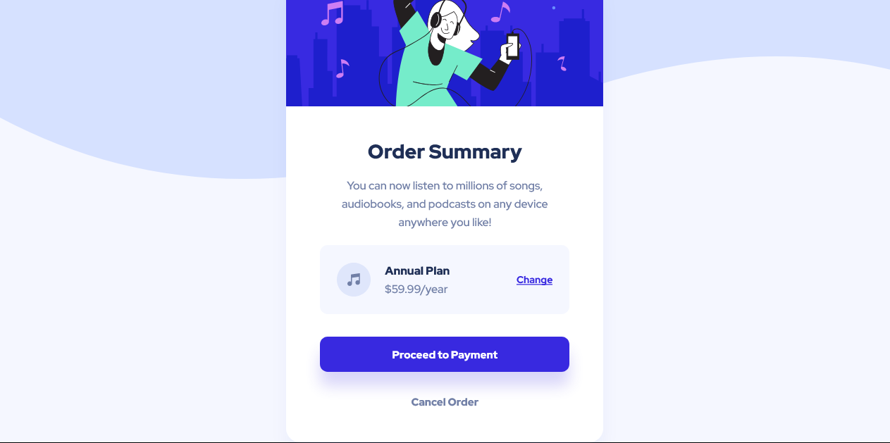

# Frontend Mentor - Order summary card solution

This is a solution to the [Order summary card challenge on Frontend Mentor](https://www.frontendmentor.io/challenges/order-summary-component-QlPmajDUj). Frontend Mentor challenges help you improve your coding skills by building realistic projects.

## Table of contents

- [Overview](#overview)
  - [The challenge](#the-challenge)
  - [Screenshot](#screenshot)
  - [Links](#links)
- [My process](#my-process)
  - [Built with](#built-with)
  - [What I learned](#what-i-learned)
  - [Continued development](#continued-development)
  - [Useful resources](#useful-resources)
- [Author](#author)
- [Acknowledgments](#acknowledgments)

## Overview

### The challenge

Users should be able to:

- See hover states for interactive elements

### Screenshot

### Links

- Solution URL: https://github.com/Kristina225/Frontend-Mentor-Project-Newbie---Order-summary-component
- Live Site URL: https://order-summary-component-fm03.netlify.app/

## My process

### Built with

- Semantic HTML5 markup
- CSS custom properties
- Flexbox

### What I learned

In this challenge I learned the basics of how to work with media queries and how to add multiple backgrounds on a page (e.g. a background image and a background color). I also learned that the flow of the text-decoration underline in anchor elements is interrupted in letters with descenders (p, g...). I solved this by removing the underline and adding a bottom border.

### Continued development

I need to learn more about background images before starting my next project.

### Useful resources

- [Stack Overflow Post - Interrupted text-decoration underline](https://stackoverflow.com/questions/49760273/text-decoration-underline-for-dom-element-doesnt-underline-for-all-letters-in-a) - This helped me solve the problem of letters with descenders interrupting the underline in anchor elements.

## Author

- Frontend Mentor - [@Kristina225](https://www.frontendmentor.io/profile/Kristina225)
- Twitter - [@KristinaPopovs3](https://twitter.com/KristinaPopovs3)

## Acknowledgments

This is where you can give a hat tip to anyone who helped you out on this project. Perhaps you worked in a team or got some inspiration from someone else's solution. This is the perfect place to give them some credit.

**Note: Delete this note and edit this section's content as necessary. If you completed this challenge by yourself, feel free to delete this section entirely.**
